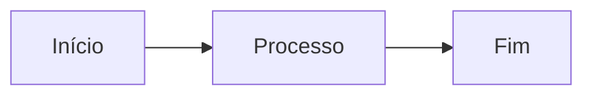

# Smoke Test — artifacts-publisher

Este é um teste de fumaça da skill `artifacts-publisher`.

## Objetivo

Validar que o pipeline funciona end-to-end em modo `--dry-run`.

## Checklist

- Theme do Maestro capturado
- Markdown convertido pra HTML
- Gate AES-GCM aplicado (encrypt.mjs roda)
- Index do repo regenerado
- README do tema criado

## Tabela teste

| Coluna A | Coluna B | Coluna C |
|----------|----------|----------|
| Linha 1  | valor    | `code`   |
| Linha 2  | **bold** | *italic* |
| Linha 3  | [link](https://example.com) | normal |

## Code block

```bash
echo "olá do smoke test"
```

## Diagrama mermaid (só renderiza no full mode)



> Blockquote: validando renderização

Fim do smoke test.
