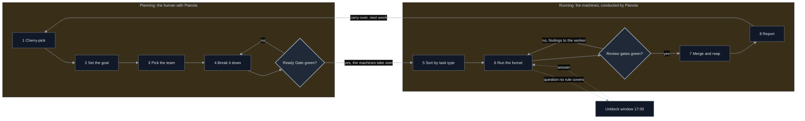
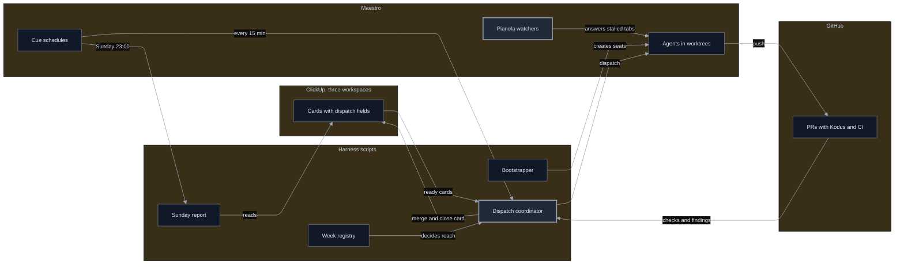
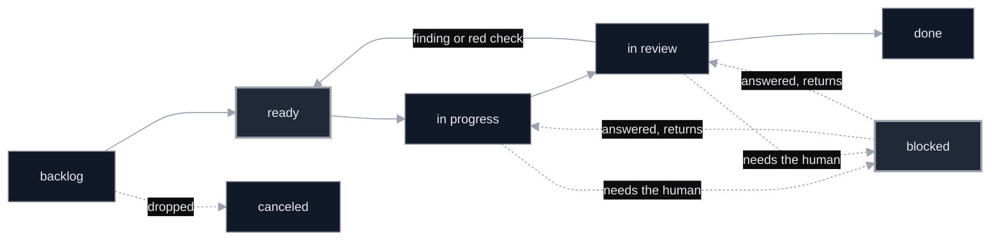
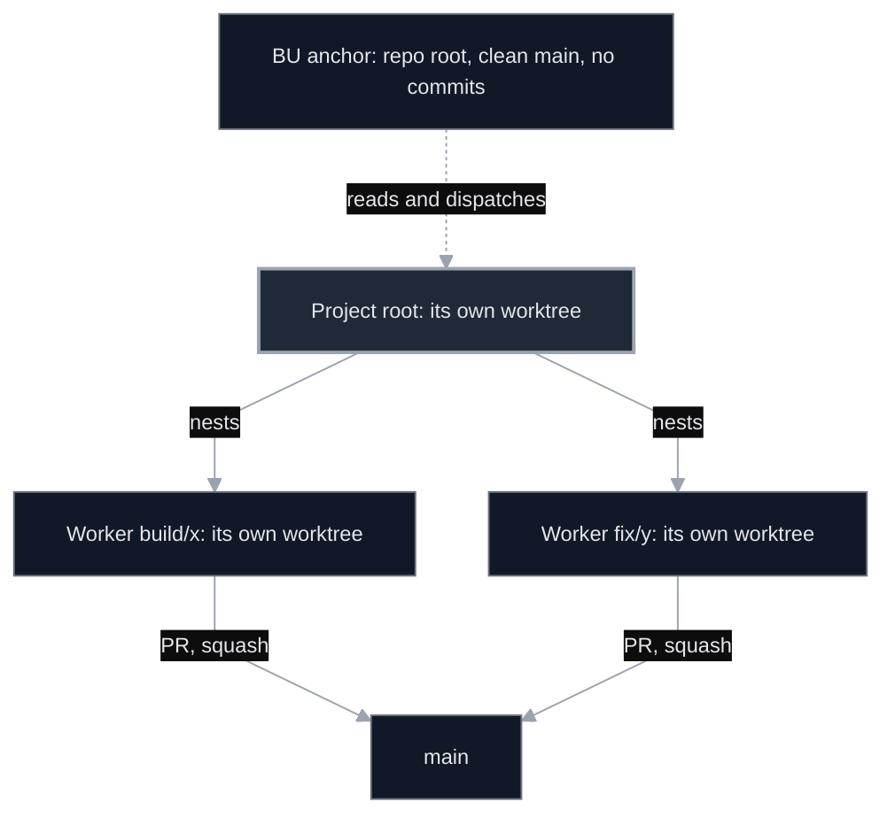
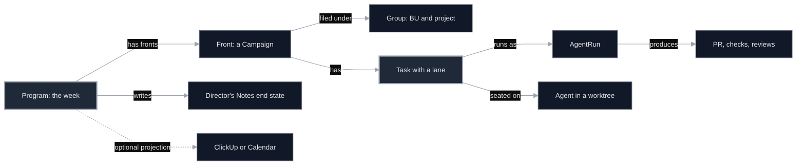
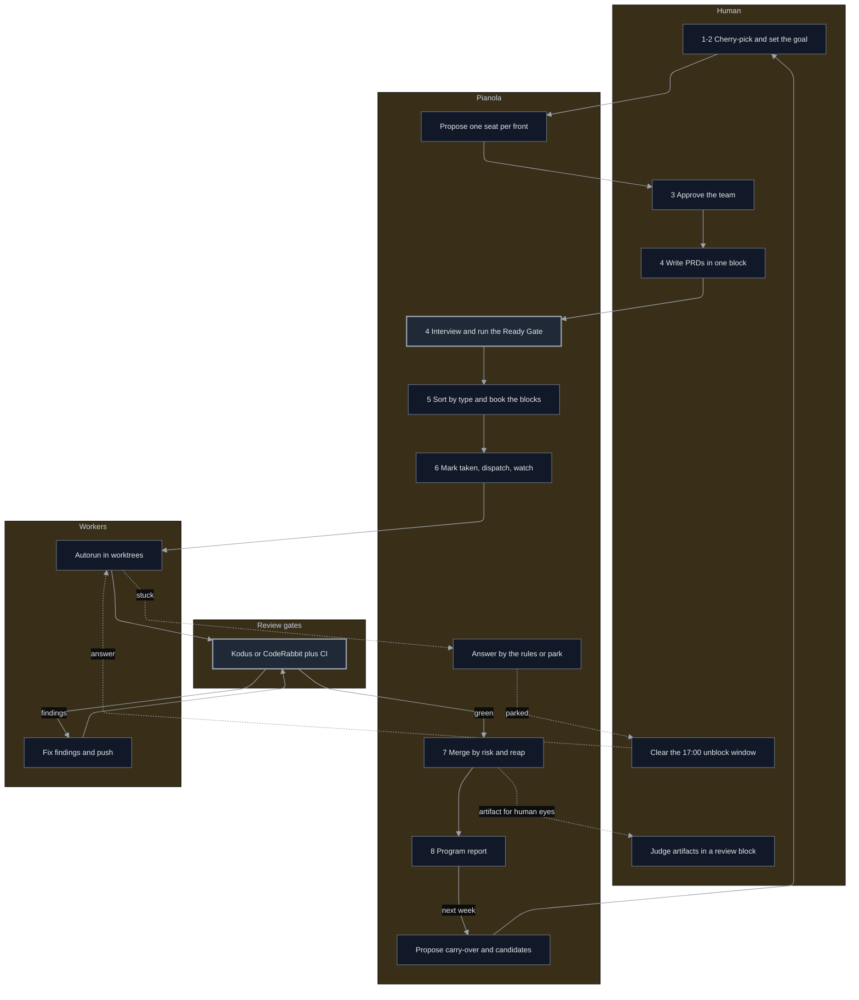
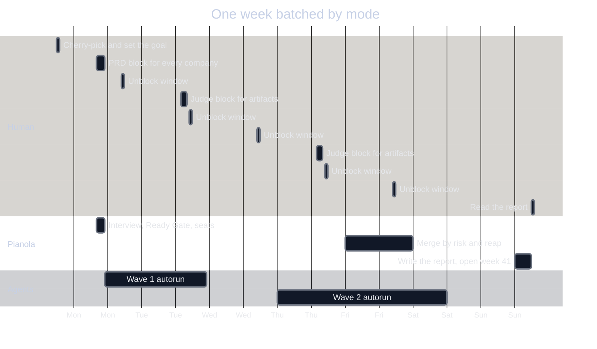

<!-- Source: https://felipeggv.github.io/vibework-knowledge/research/2026-09-maestro/artifacts/pianola-weekly-program/ · Markdown source of the page, with absolute image URLs so it can be pasted into an AI agent. -->

# Pianola, conductor of the week — feature brief

**For:** the Maestro team · **From:** Felipe Gobbi · **Date:** 2026-09-26 · **Status:** draft for discussion

**Grounded in:** Maestro `0.18.6-RC` (branch `rc`, 2026-09-25) and a harness that has run this loop for four weekly cycles (2026-w36 to 2026-w39).

> Client and business-unit names are anonymized.
> Every number below was measured on the live system, not estimated.

---

## 0. Executive summary (one page)


**The problem.** One operator runs several companies, each with several projects, and now dozens of agents too.
The week ends with a lot of activity and nothing shipped for client X.
Measured over four weekly cycles: 27 to 32 fronts a week, 69 to 78% of them carried over, and 64% of Monday's plan delivered.

**The idea.** Give Pianola a **Program**: the week's goal, cherry-picked from different projects of different companies, together with the agent team that will ship it.
Pianola becomes the interface between the human and the agents: it decides who acts, when the human acts, and what was delivered.

**The loop** (the numbers match the picture):

| # | Step | Who |
|---|---|---|
| 1 | Cherry-pick one feature from Project 1 of Company A, one from Project 3 of Company B, one from Project 5 of Company C | Human, with Pianola proposing |
| 2 | Set the goal: one Program for the week, with a budget (fronts, human hours) | Human |
| 3 | Pick the team: one seat per front, a root per project and a worker per feature | Pianola proposes, human approves |
| 4 | Break it down: PRD in one focus block, interviewed in chat, one-pager approved, Ready Gate green | Human and Pianola |
| 5 | Sort by task type: create, build, judge, unblock, each booked into the right block | Pianola |
| 6 | Run the status funnel: backlog, ready, in progress, in review, done (section 4.2) | Agents and review gates |
| 7 | Merge by risk, then reap the worktrees and worker seats | Pianola |
| 8 | Report planned against delivered per company; unfinished fronts carry over by themselves | Pianola, read by the human |

**The human touches three kinds of work, always batched:** create (PRDs and vision), judge (artifacts they can see and click) and unblock (questions no rule covers).
Everything else belongs to the machines.

**Most of the engine already exists in Maestro:**

| Already there | To add |
|---|---|
| Plan DAG + `orchestrate`, supervised watchers, rules + learned profile | The **Program** object: the week |
| Campaigns and the AgentRun ledger (PR, checks, reviews, merge) | **Lanes**: who produces a task, who consumes the result |
| `goal-run`, `auto-run`, `create-worktree` | **Ready Gate**, seats on demand, reap after merge |
| Cue, Cadenza, `snooze`, Director's Notes | **Focus blocks**, an interrupt budget, the Program report |

**Proof it works.** I run this loop today with scripts: the Bootstrapper, a dispatch coordinator, a week registry and Pianola watchers.
Pianola auto-answered 81% of stalled prompts, and mid-week injections fell from 18 to 3 or 4 once the week had a plan.
What it lacks is being native, and that is this brief.

**The ask.** Read the scope phases (section 6) and answer the open questions (section 8).
The drawings are editable: open [pianola-weekly-program.tldr](https://felipeggv.github.io/vibework-knowledge/research/2026-09-maestro/artifacts/pianola-weekly-program/assets/pianola-weekly-program.tldr) at https://www.tldraw.com (menu → Open file).
The same file also keeps the first, denser version of the loop ([v1-the-week-on-one-page-dense.png](https://felipeggv.github.io/vibework-knowledge/research/2026-09-maestro/artifacts/pianola-weekly-program/assets/v1-the-week-on-one-page-dense.png)) for reference.

---

## 1. The problem

### 1.1 Who has it

An operator (founder, agency owner, fractional CTO, consultant) who runs several companies or clients at once, each with several projects, each with several features.
With Maestro, that same person now also runs dozens of agents.

### 1.2 What goes wrong

- **There is no week.** Nothing ties "Feature X of Project Y at Company Z" and "Feature A of Project B at Company C" into one commitment with a deadline.
- **Everything interrupts.** Agents stop and ask, and each question drags the human into a different company's context. Interleaving creative, analytical and review work all day is the productivity killer.
- **Planning gets rushed, so execution drifts.** An autonomous run is only as good as the plan it received, and a weak PRD produces confident, wrong work.
- **The human becomes the reviewer of everything**, including diffs they cannot evaluate.
- **Nobody can answer "what did you do for me this week?"** per client, in one page.

### 1.3 Measured, not imagined

Three of the four weekly cycles of the reference implementation (w36 started mid-week, so it has no Monday plan):

| Week | Fronts in the week | Planned on Monday | Added mid-week | Carried from an earlier week | PM workspaces spanned |
|---|---|---|---|---|---|
| 2026-w37 | 32 | 14 | 18 | 14 | 3 |
| 2026-w38 | 29 | 26 | 3 | 20 | 2 |
| 2026-w39 | 27 | 23 | 4 | 21 | 2 |

- The w37 closing report read **29 of 45 planned cards delivered (64%)**, next to 18 fronts that were never in Monday's plan.
- The planning ritual alone cut mid-week injections from 18 to 3 or 4.
- It did **not** shrink the week: 27 to 29 fronts, 69 to 78% of them carried over, is more than any human can hold in their head.
- Conclusion: tracking is solved. **Prioritization (a budget), focus (batched human work) and delegation (the machine does the rest)** are not.

---

## 2. What good looks like

One loop per week, identical for every company and every project, in the same eight steps as the drawing in section 0.
Steps 1 to 4 are planning, where the human's brain is needed; steps 5 to 8 run on the machines, and the human only enters in booked blocks.

1. **Cherry-pick** (Sunday, 30 to 60 minutes): pick the features that must ship this week from different projects of different companies. Pianola proposes last week's carry-over and the candidates; whatever is left out stays visible in a waiting room.
2. **Set the goal**: one Program for the week, with a budget (maximum fronts, human hours) and a deadline of Sunday 23:59. Pianola enforces the budget and names what stays out.
3. **Pick the team**: one seat per front, a root per project and a worker per feature, each in its own worktree, on any engine. Pianola proposes; the human approves.
4. **Break it down**: the PRD and vision for every front are written in one focus block, across companies. Pianola interviews the human in chat, splits the PRD into tasks with a lane each, and runs the Ready Gate until the one-pager is approved.
5. **Sort by task type**: create goes to the Monday morning block, build to autorun waves, judge to review blocks, unblock to the daily 17:00 window. Only high risk, a question that blocks a whole wave, or a deadline at risk interrupts immediately.
6. **Run the funnel**: Pianola marks each card taken, dispatches it, watches it and answers what its rules allow. Review findings go back to the worker, never to the human (section 4.2).
7. **Merge and reap**: merge by risk once every gate is green, then remove the worktrees, branches and worker seats. The human judges artifacts, never diffs.
8. **Report**: planned against delivered, one page per company. Unfinished fronts carry into next week by themselves, and the loop starts again at step 1.



---

## 3. What Maestro already has, and the exact gap

| Need | What Maestro has today | Gap |
|---|---|---|
| A cross-project goal for the week | Director's Notes **Ideal End State** (free text, up to 4,000 characters, global); nested Left Bar groups for BU and project | No time-boxed, structured object; no link from the goal to work items; no planned-versus-delivered |
| A feature as a unit of delivery | **Campaign** (`src/shared/campaign/types.ts`): objective, tasks with `dependsOn`, worktree, branch, PR, check, review and merge summaries | Not bound to a period, a BU or a project; no readiness state |
| Ordered execution | **Pianola plan DAG** + `pianola orchestrate` (`pianola-tasks.ts`, `pianola-orchestrator.ts`): readiness, concurrency cap, blocked propagation, capability-aware agent selection | Starts from a hand-written plan JSON; no planning gate; no seat creation per front; no reap |
| Autonomous work | `goal-run` (exit criteria, iteration cap, `--visible`), `auto-run` and playbooks (spec-driven), `create-worktree` | Choosing goal versus spec and writing machine probes is left to the author |
| Babysitting | `pianola watch` and `supervise`, rules, learned profile, audit-before-dispatch, high risk always escalates | One supervised process per tab; the awaiting-input heuristic is English-only |
| Review evidence | **AgentRun** ledger (checks, review findings with severity, PR, merge outcome); Cue `github.pull_request` | No merge policy by risk; no loop brake; findings are not routed back to the worker |
| Human attention | `notify toast`, **Cadenza** decision prompts (buttons that answer the agent), `snooze`, `queue` | No notion of human lanes, focus blocks or an interrupt budget |
| Reporting | `director-notes synopsis -d 7` (grouped by Left Bar group, adds "Progress Toward Ideal End State"), `stats-query` | Not scoped to a Program; no Monday baseline; no one-pager per client |
| Scheduling | Cue: `time.scheduled`, `time.heartbeat`, `time.once`, `task.pending`, `agent.completed`, `github.*`, `webhook.received`, `cli.trigger` | Nothing missing, reuse as is |
| External tools | Plugin platform: `net:fetch` scoped to a host, `background:service`, `storage:sql`, `ui:panel`, `ui:grouping`, `agents:dispatch` | No ClickUp or Calendar adapters, which is fine because they should stay optional |

Most of the engine exists.
The new work is mostly **one time-boxed object, one typed lane on every task, and three gates**.

---

## 4. The reference implementation (what I run today)

I run this loop by gluing Pianola, Maestro Cue, ClickUp (three workspaces behind one CLI profile map), GitHub with a self-hosted Kodus reviewer, and Maestro notifications.
It is scripts and conventions, not a product, which is the whole point of this brief.

### 4.1 The glue



| Piece | What it does | Cadence |
|---|---|---|
| Week registry | Holds the week's fronts as pointers only (workspace plus list id), plus dated facts: `added_at`, `first_week`, and a Monday baseline | Opened Monday, closed Sunday |
| Dispatch coordinator | Sweeps `ready` cards inside the week's fronts, marks each one as taken, dispatches it to the seat named on the card, watches it, runs the merge gate, and closes the card | Cue heartbeat, every 15 minutes |
| Pianola | Babysits worker tabs with one global rule and escalation for everything else | Continuous, 49 active supervised watchers today |
| Bootstrapper | Turns a planned front into seats (group, project root, one worker per front in its own worktree), launches autorun waves, and tears everything down after merge | On demand, dry-run first |
| Sunday report | Planned against delivered, crossing ClickUp, Maestro session time and git | Cue, Sunday 23:00 |

The happy path of the coordinator is deliberately plain code, because the dispatch rule is a field read with no judgment in it.
A model is reached only as the exception handler.

**Pianola in production, 2026-08-14 to 2026-09-24:** 54 decisions, 44 auto-answered (81%), 10 escalated, all from a single global rule:

> *"Keep going as long as it poses no risk to the project structure. Re-read your safety rules and the plan on the card, write an ultra-concrete action plan, then execute to the end. Do not call the operator to approve things you could approve yourself."*

### 4.2 The status funnel manual (tool-agnostic) and the executor

This is a production method, not a ClickUp feature: it maps onto any PM tool that has statuses and two custom fields.
Each status has one meaning, an entry test and one owner, and only `ready` is ever pulled by a dispatcher.


| Status | Means | Enter when | Inside | Leave when | Moved by |
|---|---|---|---|---|---|
| **backlog** | Raw demand, dumped unfiltered (there is no icebox) | Anyone has the idea; nothing is required | The card gets its 8-question body: input, output, executor, checklist, template, quality gate, handoff, rollback | The Ready Gate passes 11/11 | The human with Pianola, in the planning block |
| **ready** | Qualified: executable alone, by the seat named on it | The Ready Gate passes (list below); code work also has its branch and linked material | It waits; this is the only status a dispatcher pulls from | Pianola marks it taken, then dispatches it | Pianola |
| **in progress** | The machine holds the ball | The card is marked taken before the worker starts, so nobody else can pick it up | The worker runs autorun in its own worktree; work sessions are timed; decisions are written on the card the moment they are made | Code: a PR is open. Knowledge: the deliverable is posted on the card | The worker |
| **in review** | The gates are running; nobody needs to act | The PR is open, or the deliverable is posted | Kodus or CodeRabbit + CI + a review agent, all blocking; a finding, a red check or a conflict sends the card back to `ready` for the worker; the loop brake measures progress | Every gate is green, then merge by risk; `AI-DRAFT` waits for human eyes first | The gates and Pianola |
| **done** | Merged or published: delivered | The Complete Gate passes (list below) | The seat is reaped; one to three learnings are recorded | Never: one card is one clean commit on `main` | Pianola, on the merge event |
| **blocked** | The ball is with the human | A question no rule covers, an artifact to judge, or a red-risk action | No dispatch and no stale clock; the question arrives in one shape: what this is, why it stopped, 2 to 5 options, a recommendation with its reason | The answer returns the card to where it came from (`in progress` or `in review`) | The human answers; Pianola moves it back |
| **canceled** | Dropped, terminal | The work will not be done | Nothing; it never re-enters the funnel | Never | The human |

**The Ready Gate (11 items):** 1 clear human name · 2 context · 3 input linked · 4 output · 5 executor · 6 how to execute · 7 quality gate · 8 handoff · 9 rollback · 10 references · 11 dispatch fields set (who produces and who consumes, as typed fields).

**The Complete Gate (6 items):** 1 output produced · 2 quality gate passed · 3 approval recorded · 4 handoff done · 5 final links recorded · 6 pendings resolved or spun into new cards.

**A card-to-card dependency is not a status.** "B cannot start until A ships" is a native link between two cards; `blocked` is a phase of one card's life.



- `ready` is reachable only through an 11-item Ready Gate: clear name, context, input, output, executor, how-to, quality gate, handoff, rollback, references, and the dispatch fields.
- `blocked` means exactly one thing: the ball is with the human. It is never a destination, and answering returns the card to where it came from.
- Any machine problem (a finding, a red check, a conflict, a missing PR) returns the card to `ready` for the worker, never to the human.
- `canceled` is terminal, and every automation excludes it the same way it excludes `done`.

The executor is two typed fields with exactly three legal shapes, because a sentence in a description cannot be queried by a coordinator:

| Seat (who produces) | Decision (who consumes the result) | Meaning | What the coordinator does |
|---|---|---|---|
| an agent id | `AI-GO` | Delegated, and the delivery goes to the world through the gates | Dispatch, review gates, merge, close |
| an agent id | `AI-DRAFT` | Delegated, and the delivery is input for a human's eyes | Dispatch, then stop at `in review` and ring the doorbell |
| empty | empty | Worked in session, with the human at the keyboard | Never touches it |
| empty | `AI-GO` or `AI-DRAFT` | Unfinished triage, the one illegal shape | Moves it to `blocked` and names the seat that fits |

Empty is never yes: an untriaged card stands still by construction.

### 4.3 The Bootstrapper

```mermaid
%%{init: {"theme":"base","themeVariables":{"primaryColor":"#111827","primaryBorderColor":"#6b7280","primaryTextColor":"#e5e7eb","lineColor":"#9ca3af","textColor":"#e5e7eb","edgeLabelBackground":"#0d0d0d","fontFamily":"JetBrains Mono, ui-monospace, monospace","fontSize":"12px"},"flowchart":{"curve":"rounded","nodeSpacing":42,"rankSpacing":62},"padding":12}}%%
flowchart LR
    subgraph DZ["Decision zone, human and AI"]
        F0["Resolve workspace"] --> F1["Already exists?"]
        F1 --> F2{"Card or list?"}
        F2 -->|"doubt"| Q["Ask the human"]
        Q --> F2
        F2 --> F3["Cards with probes"]
        F3 --> F4["Dependency waves"]
    end
    subgraph GZ["Gates"]
        G1["Scaffold gate"] --> F5["Scaffold seats"]
        F5 --> G2["Plan snapshot and launch gate"]
    end
    subgraph EZ["Execution zone"]
        D1["Launch wave after human GO"] --> D2["Prove with receipt and SHA"]
        D2 --> F7["Teardown after merge"]
    end
    F4 --> G1
    G2 --> D1
    D2 -->|"next wave"| D1
    classDef default fill:#111827,stroke:#6b7280,color:#e5e7eb,stroke-width:1px
    classDef hi fill:#1f2937,stroke:#9ca3af,color:#e5e7eb,stroke-width:2px
    class G1,G2 hi
```



- **Decision zone:** interactive, one question at a time, every external write confirmed. On any doubt the card-or-list heuristic returns "ask", because a mis-scoped autonomous worktree is expensive and one question costs nothing.
- **Gates:** read-only checklists, and red keeps you in the decision zone. The launch gate requires a fresh snapshot of the plan whose open fronts and dependency edges match the source exactly, plus one machine probe per acceptance criterion on goal-driven fronts.
- **Execution:** dry-run first. Launching autorun spends tokens, so it waits for an explicit GO. Completion is proven by a per-launch receipt plus a new git SHA, never by the worker's self-report.
- **Teardown:** a squash-aware proof (PR merged, base is `main`, PR head equals the local branch tip) runs before the worktree, the branch and the agent are removed.
- **Tested:** 24 hermetic suites with 429 assertions (counted 2026-09-02), plus an opt-in live-contract suite against the real `maestro-cli`.

The seat model, learned the hard way:



- A seat is a directory, and git allows one branch per working tree, so the seat decides where commits land.
- The first version seated several agents in one checkout: 10 seats in one working tree produced 67 commits on one branch, and only 4 of them belonged to it. A commit hook now refuses commits from a shared checkout.

Example: Feature X of Project Y at Company Z, split into two fronts.

```bash
# decision zone (read-only)
python3 phase0_resolve_dest.py --infer --context company-z
python3 phase1_exists.py --profile company-z --query "feature-x"
python3 phase2_card_vs_list.py --new-front --own-branch            # -> list
python3 phase4_plan_waves.py --profile company-z --context company-z --list-ids <ids>

# gate and scaffold: dry-run first, --apply only after the human confirms the printed plan
python3 gate_check.py --manifest manifest.json --stage scaffold
python3 phase5_scaffold.py --repo <repo> --bu company-z --project project-y --n 3 --profile company-z \
    --front build:feature-x-api:<card> --front build:feature-x-ui:<card>
#   group "[3] COMPANY-Z/PROJECT-Y", root "project-y-root-cc" on base/project-y,
#   workers "build/feature-x-api-cdx" and "build/feature-x-ui-cdx", each in its own worktree

# launch (dry-run, explicit GO, --apply), prove, and tear down after the merge
python3 goal_contract.py --profile company-z --context company-z --parent <parent-card> --json > contract.json
python3 phase_d_delegate.py --manifest manifest.json --goal-contract contract.json --apply
python3 receipt_watch.py --receipt <launch-receipt> --worktree <worktree> --timeout 900
python3 phase_e_teardown.py --manifest teardown.json --apply
```

Under the hood, Phase D fires `maestro-cli goal-run <agent-id> "<front contract>" --exit-criteria "<probe matrix>" --json` for goal-driven fronts and `maestro-cli auto-run <doc> -a <agent-id> --launch` for spec-driven ones.

### 4.4 The week and the Sunday report

The registry stores pointers and dated facts only; every name, count and percentage is resolved live at read time:

```json
{
  "week": "2026-w40-28-sep",
  "fronts": [
    { "profile": "company-z", "list_id": "<list>", "added_at": "2026-09-28", "first_week": "2026-w37-07-sep" },
    { "profile": "company-c", "list_id": "<list>", "added_at": "2026-10-01", "first_week": "2026-w40-28-sep" }
  ],
  "dropped": [
    { "profile": "company-z", "list_id": "<list>", "dropped_at": "2026-09-30", "first_week": "2026-w38-14-sep" }
  ],
  "baseline": { "at": "2026-09-28T09:00:00-03:00", "fronts": { "<list>": 7 } }
}
```

The closing report of w37, anonymized:

```text
# Week 2026-w37 · Monday 2026-09-07
> Monday's plan: <the operator's one-sentence objective>
> Executed: 29 of 45 planned cards (64%)
> Joined mid-week (outside Monday's plan, so outside the bar): 18 fronts, e.g. build/squad-x since 09-10 · 1/23
> Out of the entrance: 1 front (its in-flight cards are still watched and closed)

# Company A · 24/37
## project-1 · week 3/7 · overall 3/7 cards · 3/4 fronts open
### decide/pricing-2026 · 0/1 · no new closure
### build/voice-model · 3/3 · joined mid-week
```

- **Two lenses:** the week (only the chosen fronts) and the project (every active list in that project), so work that never entered the week stays visible.
- **`added_at`** separates "planned on Monday" from "joined mid-week", so an expansion never reads as a regression.
- **`first_week`** makes a stuck front read as "5th week" instead of looking new every Monday.
- **Blank is not zero:** a research front moved 14 of 21 cards with zero commits, and printing "0 commits" would have read as stalled when the instrument was simply wrong for that front.

### 4.5 Lessons that should shape the native design

| # | Lesson | Evidence | Implication for Pianola |
|---|---|---|---|
| 1 | A cross-company week cannot live inside a PM tool | A ClickUp Goal rejects a list from another workspace (`404 ACCESS_190`); a Key Result cannot be re-bound to other lists (HTTP 400); the Goal percentage is the mean of its Key Results, not a card-weighted figure | The Program must be Maestro-native; PM tools become optional, disposable projections |
| 2 | The executor must be typed, never prose | A card with the decision set and the seat empty was invisible to the coordinator: 1,513 sweeps over 13 days, zero dispatches | Lane fields with exactly three legal shapes, validated at write time |
| 3 | Mark the work as taken before dispatching it | Two engines could hand the same running task back to its own worker | Status flips before spawn, fail-closed |
| 4 | Findings go to the worker, never to the human | My own rule: *"Just fix it and send it on. I look at final outputs: audio, video, a page, a template, a spreadsheet, a system I can click and test. Code and review findings, no."* | Route review output to the executor; escalate only artifacts for human senses |
| 5 | Brake by progress, not by round count | One healthy PR had 9 review comments across 3 commits, which a round cap would have cut in half | Continue while there is a new commit and the finding set changed; otherwise stop with a management question: insist, cancel, or change the seat? |
| 6 | Never redispatch while a review is running | A Kodus review takes 44 to 114 minutes here, and a push mid-review lost five high-severity findings | Wait until the review finished on the current head |
| 7 | A toast is an interruption | Toasting every successful dispatch got the whole channel muted | Silence on success; notify only what is waiting on the human or failed |
| 8 | The week decides reach, not authorization | A front that leaves the week must keep its watchdog and merge gate until its in-flight cards close | A Program scopes which new work starts; supervision of work already running never narrows |
| 9 | Carry-over should be automatic and self-clearing | 21 of the 27 fronts of w39 were carried from earlier weeks | A front with open tasks follows the next Program by itself, shows its age, and leaves when its last task closes |
| 10 | Time comes from Maestro, not from folder trackers | WakaTime project names matched 0 of 4 real fronts; Maestro's `activeTimeMs` matches by construction | Report agent time per front from Maestro's own sessions |
| 11 | Watch agents, not tabs, and read any language | 367 tabs across 118 agents on this machine, one agent with 21; the awaiting-input heuristic only matches English phrasing | Agent, group or Program-level watch with a language-agnostic detector |

---

## 5. Proposal: Programs in Pianola

### 5.1 What to add to Pianola (the short list)

1. **Program:** a time-boxed object (a week or a sprint) that holds fronts across BUs and projects, with carry-over, a Monday baseline and a closing report.
2. **Lanes:** every task says who produces it (the human or an agent seat) and who consumes the result (the world through the gates, or a human's eyes). Empty is never yes.
3. **Ready Gate:** the planning quality gate. No orchestration until every front's PRD, tasks, probes, dependencies, risk and seat are resolved.
4. **Seats on demand:** orchestrate creates one worktree per front (nested under the project root), releases waves, and reaps after the merge.
5. **Review routing and merge by risk:** findings go back to the worker, a loop brake measured by progress, and a merge policy by risk.
6. **The human agenda:** batch human-lane tasks by mode into focus blocks, hold non-urgent escalations for the next window, and interrupt immediately only for high risk or the critical path.
7. **Watch at agent, group or Program level**, not one process per tab, and detect "waiting for you" in any language.
8. **Program report:** planned against delivered per BU, project and front, one page per client, fed into Director's Notes.

### 5.2 Concepts and data model



Minimal deltas to what already exists:

| Object | Change | Why |
|---|---|---|
| **Program** (new) | `id`, `period` (ISO week), `objective` (the human's words), `budget` (max fronts, human hours), `fronts[]` (campaign, group, `addedAt`, `firstProgram`, priority), `dropped[]`, `baseline` | The week as a first-class, time-boxed object |
| **CampaignTask / PianolaTask** | `lane` (`producer`: human or agent seat; `consumer`: world or human), `mode` (create, judge, unblock, build, fix, research), `exitCriteria[]` with probes, `risk` | Route work, batch human attention, gate the launch |
| **Campaign** | `programId`, `readiness` (checks and a verdict) | The Ready Gate before orchestrate |
| **Director's Notes** | Ideal End State fed by the Program objective; synopsis scoped to the Program's groups | The report almost for free |
| **Pianola watch** | Target kinds `agent`, `group` and `program`, not only `tab` | Scale and coverage |

A Program and one lane-annotated task, as JSON:

```json
{
  "id": "2026-w40-28-sep",
  "period": { "start": "2026-09-28", "end": "2026-10-04T23:59:59-03:00" },
  "objective": "Ship checkout v2 for Company Z and the onboarding flow for Company C.",
  "budget": { "maxFronts": 8, "humanHours": 12 },
  "fronts": [
    { "campaignId": "cmp-feature-x", "groupId": "grp-project-y", "addedAt": "2026-09-28", "firstProgram": "2026-w39-21-sep", "priority": 1 }
  ],
  "dropped": [],
  "baseline": { "at": "2026-09-28T09:00:00-03:00", "tasks": { "cmp-feature-x": 7 } }
}
```

```json
{
  "id": "api",
  "title": "Build the API",
  "dependsOn": ["prd"],
  "status": "pending",
  "lane": { "producer": "agent", "seat": "<agent-id>", "consumer": "world" },
  "mode": "build",
  "risk": "medium",
  "exitCriteria": [ { "criterion": "all endpoint tests pass", "probe": "npm test -- api" } ]
}
```

### 5.3 The weekly cycle, by lane



Worked example: Feature X needs seven tasks.

| # | Task | Producer | Consumer | Mode | Gate it feeds |
|---|---|---|---|---|---|
| 1 | Vision and PRD | Human | Pianola (the plan) | create | Ready Gate |
| 2 | Acceptance probes and task split, interviewed by Pianola | Human with Pianola | Pianola (the plan) | create | Ready Gate turns green |
| 3 to 6 | API, UI, tests, docs | Agent seats, one worktree per front | World | build | CI plus Kodus or CodeRabbit, looping until green |
| 7 | Review | Automated gates, or the human when there is an artifact to judge | World, or the human's eyes | judge | Merge by risk, then reap |

The human touches tasks 1 and 2 in the Monday planning block and task 7 only when there is something to see, in a review block.
Everything in between belongs to the machine.

### 5.4 Focus blocks and the interrupt budget


The Bootstrapper already knows the type at scaffold time: a **create** task opens an interview chat with the human piloting it, and a **build** task becomes an autorun in its own worktree (goal-driven when "done" is machine-checkable, spec-driven otherwise).



- Pianola groups human-lane tasks by mode: **create** (PRDs, vision, strategy), **judge** (artifacts), **unblock** (questions), and **admin**.
- The planning block comes first in the week and first in the day, because every machine hour downstream depends on it.
- Non-urgent escalations are parked with `snooze` until the next unblock window and delivered as one list, in a Cadenza with decision buttons.
- Only three things interrupt immediately: high risk, a question that blocks a whole wave (the critical path of the DAG), and a Program deadline at risk.
- Blocks come from Google Calendar when it is connected, otherwise from a default template the user edits.

### 5.5 Gates Pianola enforces

| Gate | Checks | What it blocks |
|---|---|---|
| **Ready** (planning quality) | The PRD objective was written by the human; every task has a lane; every agent task has exit probes or an ordered spec; the DAG is valid; risk is set; the seat is resolvable | `orchestrate` |
| **Launch** | A fresh snapshot of the plan equals the DAG; the human's GO for token-spending waves (configurable); the workers are trusted to run hooks | Wave release |
| **Merge by risk** | Low risk merges when every required check is green; medium merges and notifies; high waits for the human | Merge |
| **Loop brake** | A new commit and a changed finding set means continue; anything else stops with a management question | Silent, runaway spend |
| **Reap** | PR merged, base is `main`, PR head equals the local branch tip (squash-aware), then remove worktree, branch and agent | Ghost worktrees and seats |

Every gate follows the rule Pianola already lives by: the decision is recorded before anything is dispatched, and high risk always goes to the human.

### 5.6 Surfaces

| Surface | What it shows or does |
|---|---|
| Pianola chat, "plan my week" | A conversation that proposes the carry-over and candidates per BU, enforces the budget, and names what stays out |
| Program panel (Pianola Dashboard tab or a Concerto Movement) | BU, project and front rows with a per-front bar, a card-weighted total, the front's age ("3rd week"), and task counts per lane |
| "Now" Cadenza | The current focus block, the next human task, and the unblock count, with decision buttons |
| Director's Notes | A Program-scoped synopsis and a one-page export per BU or client |
| CLI (suggested) | `pianola program open / add / drop / show / report / close`, `pianola ready <campaign>`, `pianola agenda --today` |
| Cue (suggested events) | `program.opened`, `program.closing`, `front.ready`, `front.blocked`, `front.merged` |

The waiting room matters: whatever the budget leaves out is printed by name every day.
A filter that hides work is blindness; a filter that queues it in view is focus.

### 5.7 Integrations, optional and as plugins

- **The Program lives in Maestro.** No PM tool can be the source of truth for a week that spans companies (lesson 1).
- **ClickUp:** a two-way plugin (fronts to lists, tasks to cards, statuses mapped, lane fields to custom fields), projecting the Program as one disposable Goal per workspace.
- **Google Calendar:** focus blocks written as events, plus free/busy read.
- **GitHub reviewers (Kodus, CodeRabbit):** consumed as named required checks, with no special integration.
- The plugin platform already has what these need: `net:fetch` scoped to a host, `background:service`, `storage:sql`, `ui:panel`, `ui:grouping`, and `agents:dispatch`.

---

## 6. Scope, from zero code to the full loop

| Phase | Scope | Reuses |
|---|---|---|
| 0, no new code | A Program as a note, its objective pasted into Director's Notes Ideal End State, a Cue `time.scheduled` job on Sunday running `director-notes synopsis -d 7`, Pianola watchers | Everything exists today |
| 1, MVP | Program object, fronts bound to Campaigns and plans, lanes on tasks, Program panel, planned-versus-delivered report, automatic carry-over | Campaign, plan DAG, Director's Notes, Concerto |
| 2, enforce the process | Ready Gate, goal-versus-spec selection, seats per front, merge by risk, loop brake, reap | `orchestrate`, `goal-run`, `create-worktree`, AgentRun |
| 3, protect human attention | Focus blocks, interrupt budget, critical-path escalation, Cadenza unblock, snooze until the block, agent and group watch | Cadenza, `snooze`, `notify` |
| 4, adapters and learning | ClickUp and Google Calendar plugins, a budget suggested from history, stuck-front detection | Plugin platform, `stats-query` |

---

## 7. How we would know it works

| Metric | Why it matters |
|---|---|
| Planned fronts delivered, per front and card-weighted | The one number the week exists for |
| Fronts added mid-week | Measures noise; 18 down to 3 or 4 in the reference run |
| Human interrupts outside the blocks, per day | Measures protected focus |
| Time from `ready` to merged, per front | Measures machine throughput |
| Share of prompts auto-answered and PRs auto-merged, by risk | Measures real delegation |
| Fronts in their 3rd week or later | Measures what is stuck |
| Human hours by mode (create, judge, unblock) | Shows where the operator's brain actually went |

---

## 8. Open questions for the team

1. Is a Program a new entity, or a Campaign of Campaigns?
2. Where do lanes live: on PianolaTask, on CampaignTask, or on both through the task-to-run binding that already exists?
3. When a PM tool is present, is Maestro the source of truth with the PM tool as a projection (what we learned), or the other way round?
4. Should escalations be batched by default, with high risk and the critical path as the only exceptions?
5. Where should the Program live in the UI: the Pianola Dashboard, Concerto, or Director's Notes?
6. For the calendar: write focus blocks as events, or read free/busy only?
7. Should "the human's GO before a token-spending wave" be a per-Program setting?
8. How should Programs behave across SSH remotes and cross-host shared history?

---

## Appendix A — term map, harness to Maestro

| Harness term | Meaning | Closest Maestro object |
|---|---|---|
| Week registry | The week's fronts, pointers only | Proposed Program |
| Front | One feature list, one branch, one worktree | Campaign |
| Card | A unit of work with an eight-question body | CampaignTask or PianolaTask |
| Ready Gate | The 11-item qualification checklist | Proposed `readiness` |
| Executor pair | Seat plus decision, three legal shapes | Proposed `lane` |
| AI-DRAFT | The delivery is for human eyes | Proposed `consumer: human` |
| Dispatch coordinator | The 15-minute loop: sweep, dispatch, watchdog, merge | `pianola orchestrate` plus `supervise` |
| Bootstrapper | The decision, gate and execution engine that creates seats | Proposed seats on demand inside orchestrate |
| Plan snapshot | The source-derived contract required before any Auto Run | Plan validation plus exit probes |
| Seat | The directory and branch an agent commits from | An agent plus its worktree |

## Appendix B — frictions observed while running this on Maestro

- **Watch granularity:** one supervised process per tab, polling every 5 seconds, does not scale to 367 tabs across 118 agents; an agent- or group-level watch would.
- **Language:** the awaiting-input heuristic in `pianola-awaiting-detector.ts` matches English phrasing only, so a question asked in Portuguese is invisible to it.
- **New-tab rhythm:** `dispatch --new-tab` is refused by rhythm (measured at roughly one new tab every 9 seconds, regardless of which agent is targeted), and a retry with backoff fixed it; a documented rate or a queue would remove the guesswork.
- **Proof of delivery:** with two Maestro builds running at once, the CLI of one returned `success: true` for a tab of the other with zero effect; "delivered" should mean the target tab became busy.
